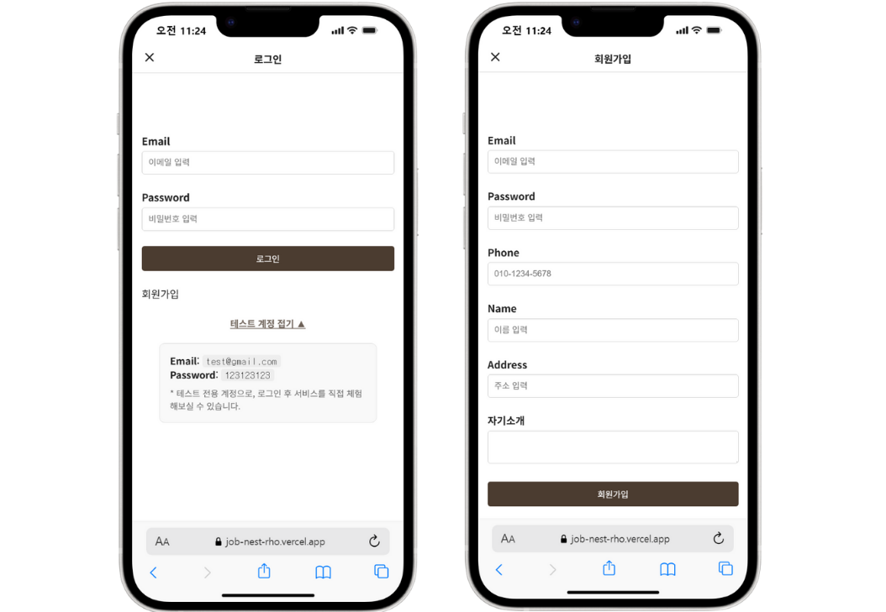
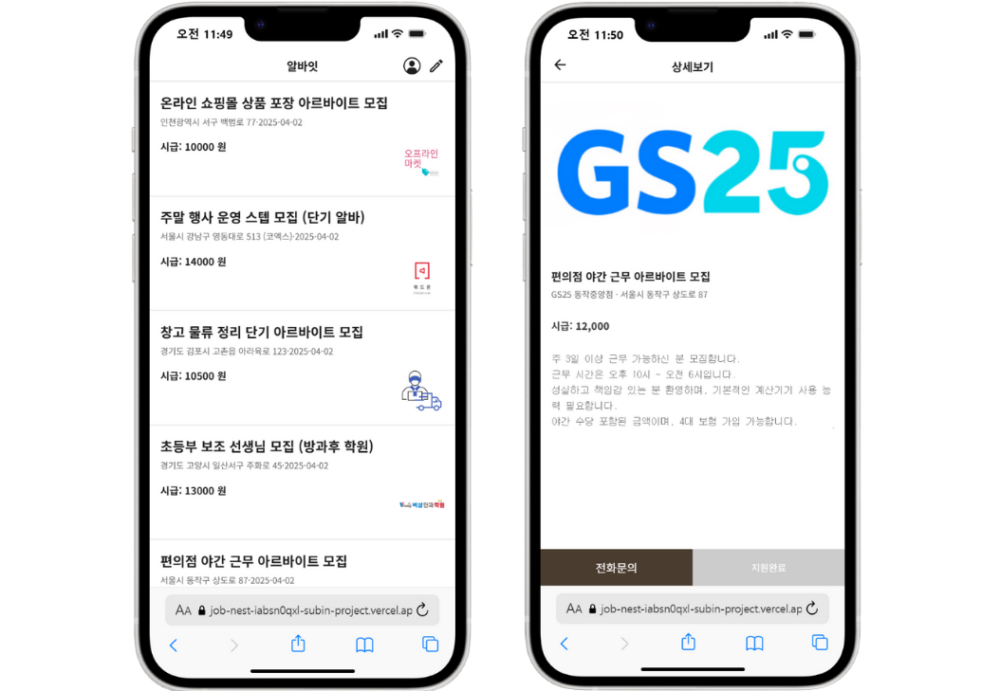
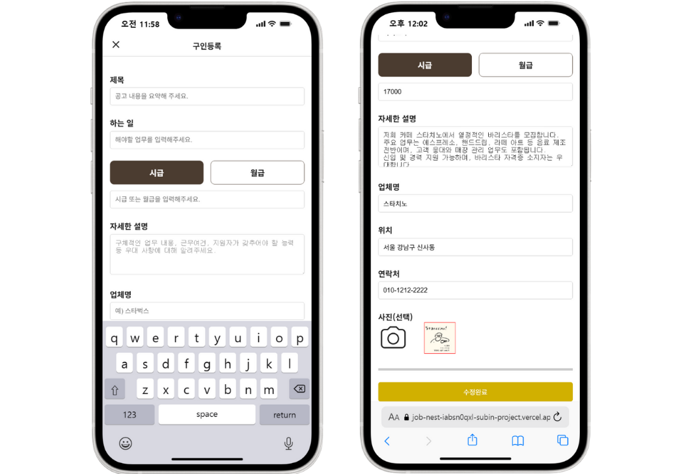
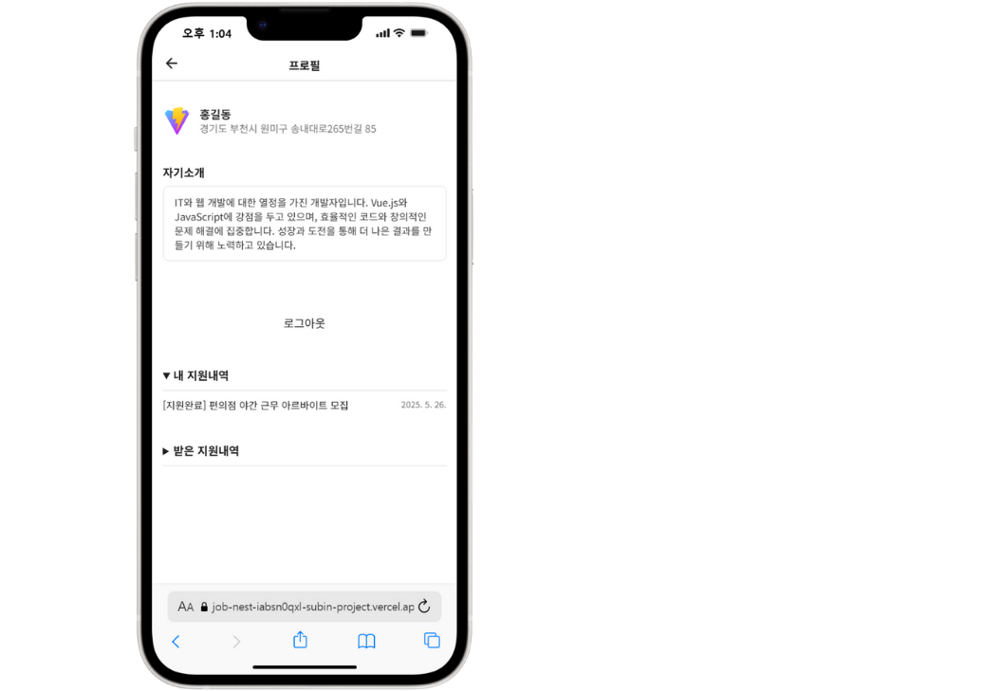

# JobNest 🏢

Mobile-first job posting platform built with Vue 3 and Supabase.
JobNest allows employers to post job listings and job seekers to find relevant positions.

## ✨ Features

| Feature               | Description                                                  |
| --------------------- | ------------------------------------------------------------ |
| **로그인/회원가입**   | Supabase Auth 기반, 이메일/비밀번호 로그인, JWT 토큰 관리    |
| **구인글 등록/관리**  | Vue 3 Composition API 기반 폼, CRUD 작업, 작성자 권한 제어   |
| **이미지 업로드**     | Supabase Storage 연동, UUID 기반 파일명 생성, 미리보기 기능  |
| **구인글 목록/상세**  | 실시간 데이터 동기화, date-fns 날짜 포맷팅                   |
| **지원 시스템**       | 중복 지원 방지, 지원자 정보 자동 연동, 지원 상태 실시간 확인 |
| **사용자 프로필**     | 지원 내역 관리, 받은 지원 내역 조회, 로그아웃 기능           |
| **반응형 네비게이션** | Vue Router 기반 동적 네비게이션, 페이지별 UI 변경            |
| **PWA 지원**          | Service Worker 오프라인 캐싱, 앱 설치 기능, 네이티브 앱 경험 |
| **보안 시스템**       | Row Level Security (RLS), 환경 변수 관리, XSS 방지           |
| **로딩 상태 관리**    | 비동기 작업 중 사용자 피드백, 진행 상황 표시                 |
| **에러 처리**         | 사용자 친화적 에러 메시지, 네트워크 오류 대응                |
| **모바일 최적화**     | 터치 인터페이스 최적화, 모바일 디자인                        |
| **실시간 동기화**     | Supabase 실시간 구독, 데이터베이스 변경사항 즉시 반영        |
| **테스트 계정**       | 즉시 체험 가능한 테스트 계정 제공, 데모 환경 구성            |

## 📱 Screenshots / UI Preview

### Login & Sign Up



---

### Job Listings & Details



---

### Job Posting & Management



---

### User Information Management



---

## 🛠️ Tech Stack

- **Frontend**: Vue 3 (Composition API)
- **Build Tool**: Vite
- **Styling**: SCSS
- **Backend**: Supabase (Database, Auth, Storage)
- **Routing**: Vue Router 4
- **Icons**: Iconify Vue
- **Date Handling**: date-fns
- **PWA Support**: vite-plugin-pwa

## 🚀 Getting Started

### Prerequisites

- Node.js 16+
- npm or yarn
- Supabase account

### Installation

1. **Clone the repository:**

   ```bash
   git clone https://github.com/yourusername/jobnest.git
   cd jobnest
   ```

2. **Install dependencies:**

   ```bash
   npm install
   ```

3. **Environment Setup**

   Create a `.env` file in the root directory:

   ```env
   VITE_SUPABASE_URL=your_supabase_project_url
   VITE_SUPABASE_KEY=your_supabase_anon_key
   ```

4. **Supabase Configuration**

   - Create a Supabase project
   - Set up tables:
     - `job_post` (title, todo, pay_rule, pay, desc, company_name, location, tel, img_url, created_at)
   - Configure a storage bucket named `images` for file uploads
   - Enable Row Level Security (RLS) policies

5. **Development Server**

   ```bash
   npm run dev
   ```

6. **Build for Production**

   ```bash
   npm run build
   ```

## 🏗️ Project Structure

```
src/
├── auth/           # Authentication logic
├── components/     # Reusable Vue components
├── router/         # Vue Router configuration
├── style/          # SCSS stylesheets
├── view/           # Page components
│   ├── Login.vue
│   ├── SignUp.vue
│   ├── JobList.vue
│   ├── JobDetail.vue
│   ├── JobPost.vue
│   ├── JobPostUpdate.vue
│   └── UserProfile.vue
├── App.vue         # Root component
├── main.js         # Application entry point
└── supabase.js     # Supabase client configuration
```

## 🔧 Key Components

- **Authentication System**: Secure login/signup with Supabase Auth
- **Job Management**: Full CRUD operations for job postings
- **Image Handling**: File upload with UUID-based naming
- **Mobile Optimization**: Mobile-only layout with SCSS modules
- **State Management**: Vue 3 Composition API with reactive refs

## 🌐 API Integration

JobNest uses Supabase for:

- **Database**: PostgreSQL with real-time subscriptions
- **Authentication**: User management and session handling
- **Storage**: File uploads and media management
- **Real-time**: Live updates across connected clients
